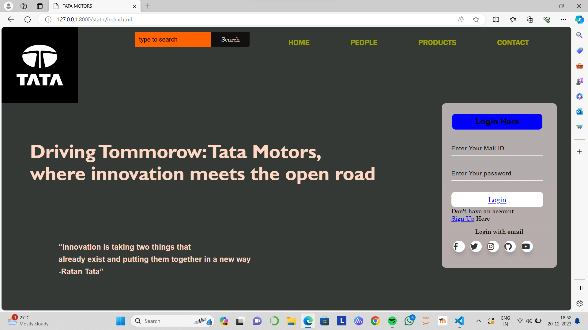
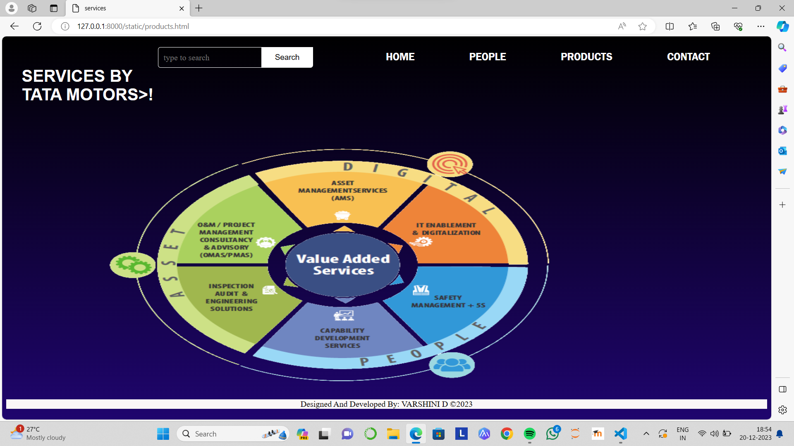
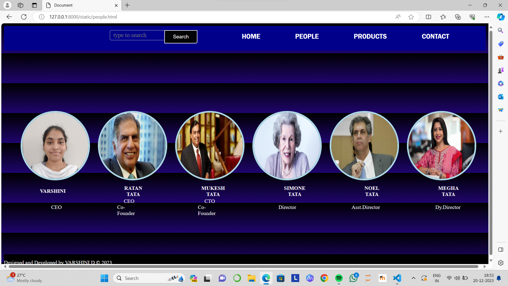
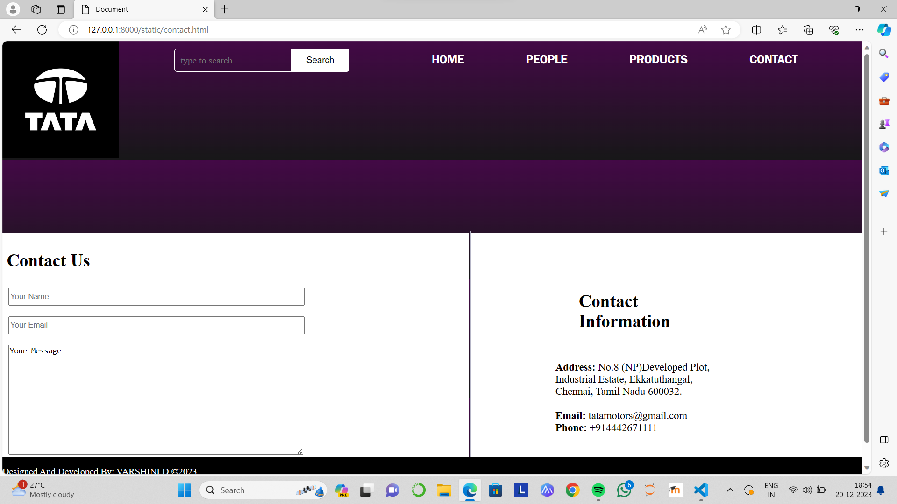

# Ex.07 Software Product Company Website
## Date:19.12.2023

## AIM:
To develop a static company website to display the softwares and services provided by the company.

## DESIGN STEPS:

### Step 1:
Requirement collection.

### Step 2:
Creating the layout using HTML and CSS.

### Step 3:
Updating the sample content.

### Step 4:
Choose the appropriate style and color scheme.

### Step 5:
Validate the layout in various browsers.

### Step 6:
Validate the HTML code.

### Step 7:
Publish the website in the given URL.

## PROGRAM:
```
index.html


<!DOCTYPE html>
<html lang="en">
<head>
    <meta charset="UTF-8">
    <link rel="stylesheet" href="style.css">
    <title>TATA MOTORS</title>
    <style>
      *{
    margin: 0px;
    padding: 0px;
    font-family: century;
}
header{
    background-image: url(bg.png);
    height: 100vh;
    background-size: cover;
    min-height: 100px;
    background-position: center;
    background-blend-mode: lighten;
    opacity: 50px;
    filter: brightness(60px);
}
ul{
    float: right;
    list-style-type: none;
    margin-top: 30px;
    min-height: 400px;
    margin-right: 60px;
    font-size: 17px;
}
ul li{
    display: inline-block;
}
ul li a{
    text-decoration: double;
    color: rgb(160, 162, 4);
    padding: 5px 50px;
    border: 1px solid transparent;
    transition: 0.5 ease;
    font-family: 'Franklin Gothic Medium', 'Arial Narrow', Arial, sans-serif;
    font-size: larger;
}

ul li a:hover{
    background-color: black;
    color: white;
}
.search{
    width: 330px;
    float:right;
    margin-right: 20px;
}
.srch{
    font-family: 'Times New Roman';
    width: 200px;
    height: 40px;
    background: rgb(255, 98, 0);
    border: 1px solid rgb(255, 123, 0);
    margin-top: 13px;
    color: rgb(255, 102, 0);
    border-right: none;
    font-size: 16px;
    float: left;
    padding: 10px;
    border-bottom-left-radius: 5px;
    border-top-left-radius: 5px;

}
.btn{
    width: 100px;
    height: 40px;
    background: #120f0f;
    border: 2px solid#141313;
    margin-top: 13px;
    color:rgb(241, 237, 237);
    font-size: 15px;
    border-bottom-right-radius: 5px;
    border-bottom-right-radius: 5px;
}
.btn:focus{
    outline: none;
}
.srch:focus{
    outline: none;

}
.logo img{
    float: inline-start;
    padding: 0px;
}
.title{
    position: absolute;
    left: 5%;
    top: 40%;
    color:rgb(187, 61, 3);
    font-size:20px;
}
 b{
    color:rgb(255, 216, 196);
    border-color:black;
    font-size: 50px;
    font-family: 'Gill Sans', 'Gill Sans MT',  'Trebuchet MS', sans-serif;
}
.button {
    position: absolute;
    left: 30%;
    top: 95%;   
    width: 500px;
    border-radius: 50px;
    border: 2px;
    font-weight: 600;
    font-size: 20px;
}
.button .button{
transition: 0.5s;
}
.form
{
    width: 250px;
    height: 380px;
    background: linear-gradient(to top, rgba(214, 202, 202, 0.8)50%,rgba(210, 202, 202, 0.8)50%);
    position: absolute;
    top: 200px;
    left: 1150px;
    border-radius: 10px;
    padding: 25px;
}
.form h2{
    width: 220px;
    font-family: sans-serif;
    color: black;
    text-align: center;
    color: black;
    font-size: 22px;
    background-color: blue;
    border-radius: 10px;
    margin: 2px;
    padding: 8px;
}
.form input{
    width: 240px;
    height: 35px;
    background: transparent;
    border-bottom: 1px solid white;
    border-top: none;
    border-right: none;
    border-left: none;
    color: black;
    font-size: 15px;
    letter-spacing: 1px;
    margin-top: 30px;
    font-family: sans-serif;
}
.t{
    position: absolute;
    left: 10%;
    top: 75%;
    font-size:smaller;
}
.t b{
    color: rgb((255, 255, 255)55, 255, 255);
    font-size: 20px;
    font-family: Arial, Helvetica, sans-serif;
}
.form input:focus{
    outline: none;
}
::placeholder{
    color: black;
    font-family: Arial;
}
.btnn{
    width: 240px;
    height: 40px;
    background: white;
    border: none;
    margin-top: 30px;
    font-size: 18px;
    border-radius: 10px;
    cursor: pointer;
    color: black;
}
.btnn:hover{
    background: black;color: #fff   ;
}
.form .link{
    font-family: Arial, Helvetica, sans-serif;
    font-size: 17px;
    padding-top: 20px;
    text-align: center;

}
.liw{
    padding-top: 15px;
    padding-bottom: 10px;
    text-align: center;
}
.wrapper .icon{
    position: relative;
    background-color: #ffffff;
    border-radius: 50%;
    margin: 5px;
    width: 30px;
    height: 30px;
    line-height: 30px;
    font-size: 20px;
    display: inline-block;
    align-items: center;
    box-shadow: 0 10px 10px rgba(0, 0, 0, 0.1);
    cursor: pointer;
    transition: all 0.2s cubic-bezier(0.68, -0.55, 0.265, 1.55);
    color: #333;
    text-decoration: none;
  }
  .wrapper .tooltip {
    position: absolute;
    top: 0;
    line-height: 1.5;
    font-size: 14px;
    background-color: #ffffff;
    color: #ffffff;
    padding: 5px 8px;
    border-radius: 5px;
    box-shadow: 0 10px 10px rgba(0, 0, 0, 0.1);
    opacity: 0;
    pointer-events: none;
    transition: all 0.3s cubic-bezier(0.68, -0.55, 0.265, 1.55);
  }
  .wrapper .tooltip::before {
    position: absolute;
    content: "";
    height: 8px;
    width: 8px;
    background-color: #ffffff;
    bottom: -3px;
    left: 100%;
    transform: translate(-50%) rotate(45deg);
    transition: all 0.3s cubic-bezier(0.68, -0.55, 0.265, 1.55);
  }
  .wrapper .icon:hover .tooltip {
    top: -45px;
    opacity: 1;
    visibility: visible;
    pointer-events: auto;
  }
  .wrapper .icon:hover span,
  .wrapper .icon:hover .tooltip {
    text-shadow: 0px -1px 0px rgba(0, 0, 0, 0.1);
  }
  .wrapper .facebook:hover,
  .wrapper .facebook:hover .tooltip,
  .wrapper .facebook:hover .tooltip::before {
    background-color: #3b5999;
    color: #ffffff;
  }
  .wrapper .twitter:hover,
  .wrapper .twitter:hover .tooltip,
  .wrapper .twitter:hover .tooltip::before {
    background-color: #46c1f6;
    color: #ffffff;
  }
  .wrapper .instagram:hover,
  .wrapper .instagram:hover .tooltip,
  .wrapper .instagram:hover .tooltip::before {
    background-color: #e1306c;
    color: #ffffff;
  }
  .wrapper .github:hover,
  .wrapper .github:hover .tooltip,
  .wrapper .github:hover .tooltip::before {
    background-color: #333333;
    color: #ffffff;
  }
  .wrapper .youtube:hover,
  .wrapper .youtube:hover .tooltip,
  .wrapper .youtube:hover .tooltip::before {
    background-color: #de463b;
    color: #ffffff;
  }
  h1{
    color:rgb(255, 102, 0);
  }
    </style>
<link rel='stylesheet' href='https://cdnjs.cloudflare.com/ajax/libs/font-awesome/5.15.1/css/all.min.css'>
</head>
<body style="background-image: url(car.jpg);">
    <header>
        <div class="main">
            <ul>
                <li><a href="index.html">HOME</a></li>
                <li><a href="people.html">PEOPLE</a></li>
                <li><a href="products.html">PRODUCTS</a></li>
                <li><a href="contact.html">CONTACT</a></li>
            </ul>
        </div>
        <div class="search" >
            <input class="srch" type="search" name="" placeholder="type to search">
            <a href="#"><button class="btn">Search</button></a>
        </div>
        <div class="logo">
            
        </div>
        <div class="title" >
            <h1><b>Driving Tommorow: Tata Motors,<br>where innovation meets the open road</b></h1>
        </div>
        <div class="form">
            <h2>Login Here</h2>
            <input type="email" name="email" placeholder="Enter Your Mail ID">
            <input type="password" name=" " placeholder="Enter Your password">
            <button class="btnn"><a href="#">Login</a></button>
            <p class="Link">Don't have an account<br>
            <a href="#">Sign Up</a> Here</p>
            <p class="liw">Login with email</p>
        
        <div class="wrapper">
            <a href="#" class="icon facebook">
              <div class="tooltip">Facebook</div>
              <span><i class="fab fa-facebook-f"></i></span>
            </a>
            <a href="#" class="icon twitter">
              <div class="tooltip">Twitter</div>
              <span><i class="fab fa-twitter"></i></span>
            </a>
            <a href="#" class="icon instagram">
              <div class="tooltip">Instagram</div>
              <span><i class="fab fa-instagram"></i></span>
            </a>
            <a href="#" class="icon github">
              <div class="tooltip">Github</div>
              <span><i class="fab fa-github"></i></span>
            </a>
            <a href="#" class="icon youtube">
              <div class="tooltip">Youtube</div>
              <span><i class="fab fa-youtube"></i></span>
            </a>
          </div>
          </div>

        <div class="t">
            <h1><b>“Innovation is taking two things that <br>already exist and putting them together in a new way<br>-Ratan Tata”</b></h1>
        </div>
       
</body>
</html>

products.html

<html>
    <head>
      <title>services</title>
      
      <style>
                  body{
                  background: linear-gradient(rgb(0, 0, 0) , rgb(31, 5, 110) );
                  }
                  
              ul{
                  float: right;
                  list-style-type: none;
                  margin-top: 20px;
                  min-height: 10%;
                  margin-right: 60px;
                  font-size: 17px;
              }
              ul li{
                  display: inline-block;
              }
              ul li a{
                  text-decoration: double;
                  color: #ffffff;
                  padding: 5px 50px;
                  border: 1px solid transparent;
                  transition: 0.5 ease;
                  font-family: 'Franklin Gothic Medium', 'Arial Narrow', Arial, sans-serif;
                  font-size: larger;
              }
  
              ul li a:hover{
                  background-color: black;
                  color: #fff;
              }
              .search{
                  width: 330px;
                  float:right;
                  margin-right: 20px;
              }
              .srch{
                  font-family: 'Times New Roman';
                  width: 200px;
                  height: 40px;
                  background: transparent;
                  border: 1px solid #fff;
                  margin-top: 13px;
                  color: black;
                  border-right: none;
                  font-size: 16px;
                  float: left;
                  padding: 10px;
                  border-bottom-left-radius: 5px;
                  border-top-left-radius: 5px;
  
              }
              .btn{
                  width: 100px;
                  height: 40px;
                  background: #fff;
                  border: 2px solid#ffffff;
                  margin-top: 13px;
                  color:black;
                  font-size: 15px;
                  border-bottom-right-radius: 5px;
                  
              }
              .btn:focus{
                  outline: none;
              }
              .srch:focus{
                  outline: none;
  
              }
  
  footer {
      background-color: #faf7f7;
      color: #040303;
      text-align: center;
  
      }
     
  footer p{
    padding: 0px;
  }  
  .im{
  margin: 35px;
  margin-left: 200px;
  }
  .h1{
      font-size: medium;
      font-family: Arial, Helvetica, sans-serif;
      color: #fff;
      padding: 30px;
      margin-right: 20%;
  }
  
      </style>
    </head>
  <body>
    <header>
      <div class="main">
          <ul>
              <li><a href="index.html">HOME</a></li>
              <li><a href="people.html">PEOPLE</a></li>
              <li><a href="products.html">PRODUCTS</a></li>
              <li><a href="contact.html">CONTACT</a></li>
          </ul>
      </div>
      
      <div class="search" >
          <input class="srch" type="search" name="" placeholder="type to search">
          <a href="#"><button class="btn">Search</button></a>
      </div>
     <div class="h1">
      <h1> SERVICES BY TATA MOTORS>!</h1>
      </div>
      <div class="im">
  
  </div>
    <footer>
      <p>Designed And Developed By: VARSHINI D &copy;2023</p>
  </footer>
  
  </body>
  </html>
  
people.html

<!DOCTYPE html>
<html lang="en">
<head>
    <meta charset="UTF-8">
    <meta name="viewport" content="width=device-width, initial-scale=1.0">
    <title>Document</title>
    <style>
            body{
      background: linear-gradient(rgb(0, 0, 0) , rgb(31, 5, 110) );
    }
    
ul{
    float: right;
    list-style-type: none;
    margin-top: 20px;
    min-height: 10%;
    margin-right: 60px;
    font-size: 17px;
}
ul li{
    display: inline-block;
}
ul li a{
    text-decoration: double;
    color: #ffffff;
    padding: 5px 50px;
    border: 1px solid transparent;
    transition: 0.5 ease;
    font-family: 'Franklin Gothic Medium', 'Arial Narrow', Arial, sans-serif;
    font-size: larger;
}

ul li a:hover{
    background-color: black;
    color: #fff;
}
.search{
    width: 330px;
    float:right;
    margin-right: 20px;
}
.srch{
    font-family: 'Times New Roman';
    width: 200px;
    height: 40px;
    background: transparent;
    border: 1px solid #fff;
    margin-top: 13px;
    color: black;
    border-right: none;
    font-size: 16px;
    float: left;
    padding: 10px;
    border-bottom-left-radius: 5px;
    border-top-left-radius: 5px;

}
.btn{
    width: 100px;
    height: 40px;
    background: #fff;
    border: 2px solid#ffffff;
    margin-top: 13px;
    color:black;
    font-size: 15px;
    border-bottom-right-radius: 5px;
    
}
.btn:focus{
    outline: none;
}
.srch:focus{
    outline: none;

}
      
        footer{

        background-color:black;
        height:30px;
        bottom:0;
        width:100%;
        color:white;
        position:absolute;
        
        }
        header
        {
        background-color:darkblue;
        height:10vh;
        width:100%;
        color:white;
        }
        header h2{
        position:absolute;
        color:white;
        margin-top:10px;
        margin-left:10px;
        }
        .search input{
            width:18%;
            height: 30px;

        }
        .search button{
            color:white;
            background-color: rgb(2, 3, 4);
            padding: 5px;
            text-align: center;
        }
        .search input,button{
            position: absolute;
            right: 880px;
            font-size: 18px;
            border-color:silver;
        }
        .small
        {
           width:200px;
           height:200px;
           margin:10px;
        }
        .border{
        border-width:5px;
        border-color:lightblue;
        border-style:solid;
        border-radius:50%;
        }
        .cirpic{
            position:absolute;
            top:35%;
            margin-left: 40px;
            padding: 0px;
            
        }
        .text{
           position: absolute;
            top:55%;
            margin-left: 20px;
            font-size: 16px;
            
        }
        .text2{
            position:absolute;
            top:61%;
            margin-left:58px;
        }
    
    </style>
</head>
<body>
    <header>
        <div class="main">
        
        <ul>
        <li><a href="index.html">HOME</a></li>
        <li><a href="people.html">PEOPLE</a></li>
        <li><a href="products.html">PRODUCTS</a></li>
        <li><a href="contact.html">CONTACT</a></li>
        </ul>
    </div>
    <div class="search" >
        <input class="srch" type="search" name="" placeholder="type to search">
        <a href="#"><button class="btn">Search</button></a>
    </div>
        <div class="cirpic">
            
            
            
            
            
            
        </div>
        <div class ="text">
            <table cellpadding="87">
                <tr div class="head">
                    <th>VARSHINI</th>
                    <th>RATAN TATA</th>
                    <th>MUKESH TATA</th>
                    <th>SIMONE TATA</th>
                    <th>NOEL TATA</th>
                    <th>MEGHA TATA</th>
                </tr>
            </table>
        </div>
        <div class="text2">
            <table cellpadding="83">
                <tr>
                    <td>CEO</td>
                    <td>&nbsp;&nbsp;&nbsp;&nbsp;&nbsp;CEO<br>Co-Founder</td>
                    <td>&nbsp;&nbsp;&nbsp;&nbsp;&nbsp;CTO<br>Co-Founder</td>
                    <td>Director</td>
                    <td>Asst.Director</td>
                    <td>Dy.Director</td>
                </tr>
            </table>
        </div>
    
        <footer>
             <p>Designed and Developed by VARSHINI D &copy; 2023</p>
      </footer>
               
</body>
</html>

contact.html

<!DOCTYPE html>
<html lang="en">
<head>
    <meta charset="UTF-8">
    <meta name="viewport" content="width=device-width, initial-scale=1.0">
    <title>Document</title>
    <style>
        h1{
        color: blue;
        font-size: 45px;
        font-family:Georgia, 'Times New Roman', Times, serif;
        position: absolute;
        top:35%;
        }
        body{
        background-color:silver;
        margin:0;
        }
        .navbar ul{
        list-style-type:none;
        background-color:darkblue;
        
        }
        .navbar a{
         color:white;
        text-decoration:none;
        padding:25px;
        display:flex;
        text-align:left;
        position: relative;
        font-size:20px;
        top:-95px;
        
        }
        .navbar a:hover{
         background-color:lightblue;
        size:60px;
        cursor: pointer;
        }
        .navbar li{
        float:right;
        }
        h2{
        color:white;
        font-family:monospace;
        font-size:60px;
        background-color:darkblue;
        }
        footer{

        background-color:black;
        height:30px;
        bottom:0;
        width:100%;
        color:white;
        position:absolute;
        
        }
        body{
      background: linear-gradient(rgb(67, 9, 70) , rgb(23, 23, 24) );
    }
    
ul{
    float: right;
    list-style-type: none;
    margin-top: 20px;
    min-height: 10%;
    margin-right: 60px;
    font-size: 17px;
}
ul li{
    display: inline-block;
}
ul li a{
    text-decoration: double;
    color: #ffffff;
    padding: 5px 50px;
    border: 1px solid transparent;
    transition: 0.5 ease;
    font-family: 'Franklin Gothic Medium', 'Arial Narrow', Arial, sans-serif;
    font-size: larger;
}

ul li a:hover{
    background-color: black;
    color: #fff;
}
.search{
    width: 330px;
    float:right;
    margin-right: 20px;
}
.srch{
    font-family: 'Times New Roman';
    width: 200px;
    height: 40px;
    background: transparent;
    border: 1px solid #fff;
    margin-top: 13px;
    color: black;
    border-right: none;
    font-size: 16px;
    float: left;
    padding: 10px;
    border-bottom-left-radius: 5px;
    border-top-left-radius: 5px;

}
.btn{
    width: 100px;
    height: 40px;
    background: #fff;
    border: 2px solid#ffffff;
    margin-top: 13px;
    color:black;
    font-size: 15px;
    border-bottom-right-radius: 5px;
    
}
.btn:focus{
    outline: none;
}
.srch:focus{
    outline: none;

}
  
        .coform {
            background-color: white;
            top:43%;
        }
        .coform form{
            position: absolute;
            top:45%;
        }
        .coform form h3{
            font-size:30px;
        }
        .coform form input{
            margin-left: 10px;
            width:500px;
            height:25px;
        }
        .coform form textarea{
            margin-left: 10px;
        }
        .coform form button{
            position: absolute;
            background-color:  rgb(22, 165, 222);
            color:white;
            border-radius: 20%;
            margin-left: 10px;
        }
        #submit{
            left:0px;
            width:20%;
        }
        .vl{
            position:absolute;
            border-left: 3px solid rgb(182, 182, 199);
            height: 450px;
            margin-left: 800px;
            top:44%;
        }
        #ci{
            font-size: 30px;
            margin-left: 40px;
        }
        .info{
            position:absolute;
            top:44.3%;
            font-size: 18px;
            background-color: white;
            padding:70px 250px 95px 147px ;
            margin-left: 800px;
        }
        .coform form{
            background-color: white;
            top:44.3%;
            margin-left: 0px;
            padding:0px 282px 50px 0px;
        }
    </style>
    </head>
    <body>
        <header>
            
            
                <div class="main">
                
                <ul>
                <li><a href="index.html">HOME</a></li>
                <li><a href="people.html">PEOPLE</a></li>
                <li><a href="products.html">PRODUCTS</a></li>
                <li><a href="contact.html">CONTACT</a></li>
                
                
                </ul>
            </div>
            <div class="search" >
                <input class="srch" type="search" name="" placeholder="type to search">
                <a href="#"><button class="btn">Search</button></a>
            </div>

            
            
     
            <div class="logo">
                
            </div>
            <div class="coform">
            <form>
              <h3>&nbsp;Contact Us</h3>
              <input type="text" placeholder="Your Name"><br><br>
              <input type="text" placeholder="Your Email"><br><br>
              <textarea rows="12" cols="66" >Your Message
              </textarea><br>
              <button id="submit">Submit</button>
            </form>
        </div>
        <div class="info">
            <h3 id="ci" >Contact Information</h3><br>
            <b>Address: </b>No.8 (NP)Developed Plot, Industrial Estate, Ekkatuthangal, Chennai, Tamil Nadu 600032. <br><br>
            <b>Email: </b>tatamotors@gmail.com<br>
            <b>Phone: </b>

            +914442671111
        </div>
        <div class="vl"></div>
    </div>
    <footer>
        <p>Designed And Developed By: VARSHINI D &copy;2023</p>
  </footer>
                   
    </body>
    </html>

```

## OUTPUT:





## RESULT:
The program for designing software company website using HTML and CSS is completed successfully.
